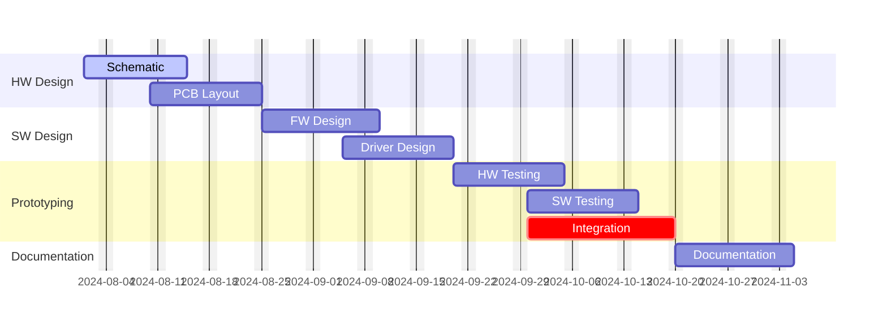

# DewHeater-TM

This project aims to develop an open source, simple and reliable controller for a telescope dew heater.

## Self-proposed timeline

> [!NOTE]
> This timeline is a draft, it should not be considered realistic or reliable.

The files in this repository are provided "as is", without warranty of any kind.

